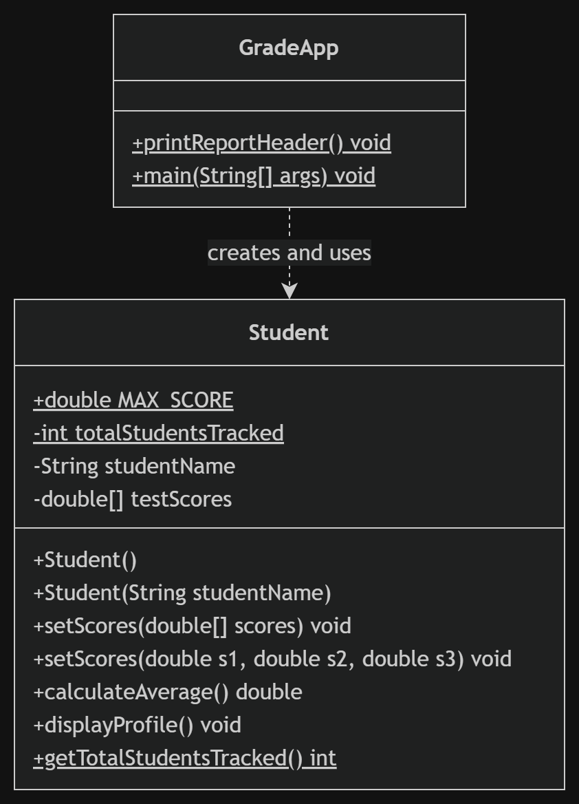
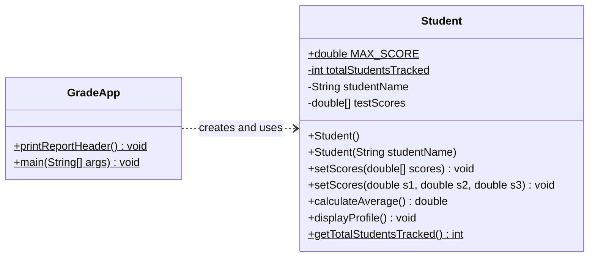

# Student Grade Tracker (Java)

A small console program that tracks students and their test scores. It is built around one `Student` class and a `GradeApp` driver class that creates students, sets their scores two different ways, and prints a report.

## Concepts practiced

- Encapsulation: private fields with public methods
- Static vs instance members: a shared student counter vs per-student name and scores
- A `final` constant for the maximum score
- Constructor chaining: the no-argument constructor calls the main one with `this("Unknown")`
- Method overloading: two `setScores` versions (array, or three separate values)
- Arrays and input checks: scores above `MAX_SCORE` are capped

## Class diagram



The same diagram as text (Mermaid), which GitHub draws automatically:



In the diagram, `$` marks a static member, `+` is public and `-` is private.

## How to run

In Eclipse, run `GradeApp.java`. From a terminal, inside the `src` folder:

```
javac assignment2/*.java
java assignment2.GradeApp
```

## Sample output

```
=================================
  --- JAVA TECH STUDENT SYSTEM ---
=================================
Student: Amina Khan
  Test 1: 85.5
  Test 2: 90.0
  Test 3: 78.0
  Average: 84.50

Total students tracked: 2
```

The full run also tests edge cases: a student created with no name, a score above 100 (capped), an array with only two scores, and a student whose scores were never set.
