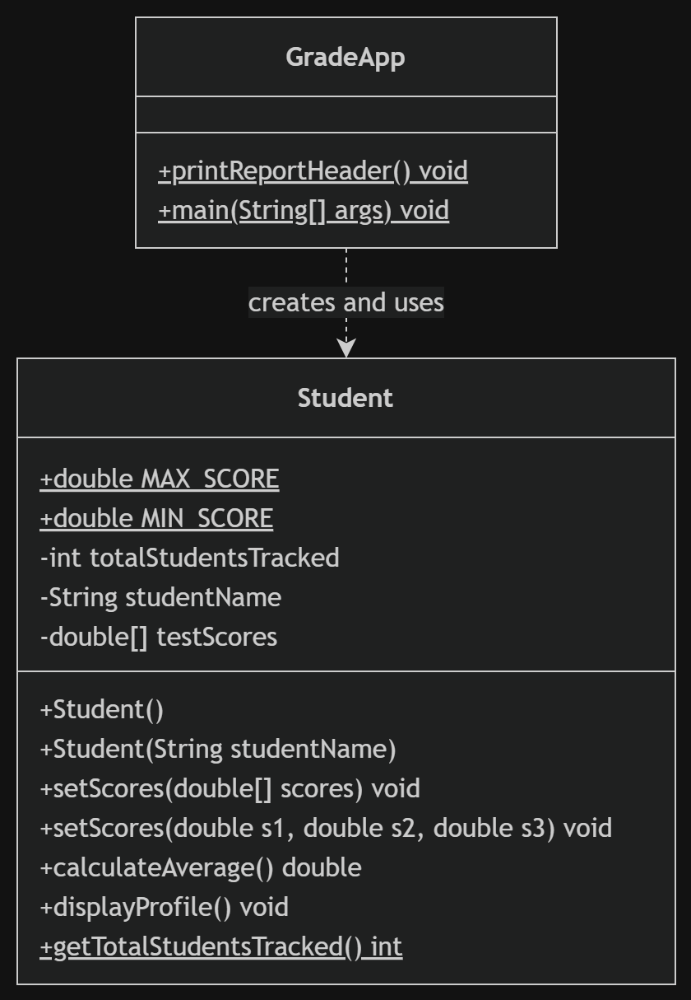
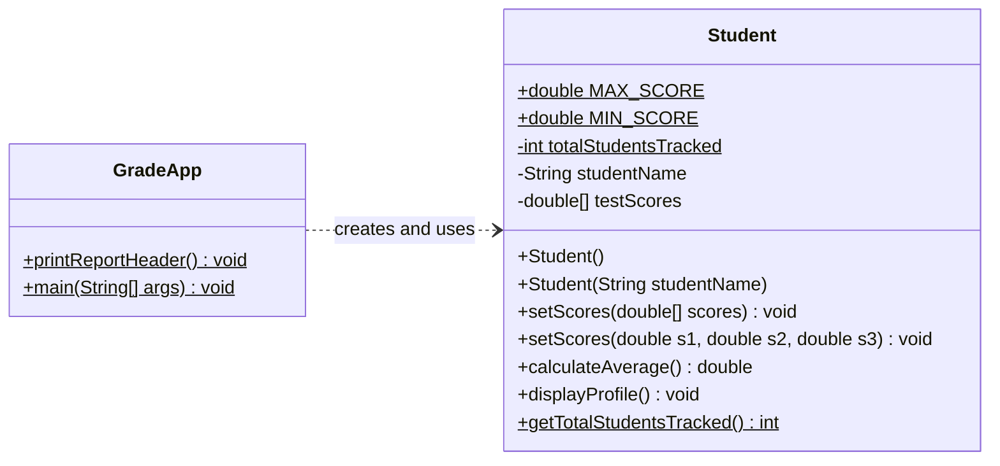

# Student Grade Tracker (Java)

**Status:** Started as a COMP 228 course assignment, then extended with input validation and 13 JUnit tests.

A small console program that tracks students and their test scores. It is built around one `Student` class and a `GradeApp` driver class that creates students, sets their scores two different ways, and prints a report.

## Concepts practiced

- Encapsulation: private fields with public methods
- Static vs instance members: a shared student counter vs per-student name and scores
- `final` constants for the highest and lowest score (`MAX_SCORE`, `MIN_SCORE`)
- Constructor chaining: the no-argument constructor calls the main one with `this("Unknown")`
- Method overloading: two `setScores` versions (array, or three separate values)
- Arrays and input checks: scores above `MAX_SCORE` are capped, scores below `MIN_SCORE` are raised, and a `null` array is ignored
- Unit testing with JUnit 5

## Project structure

```
student-grade-tracker/
├── README.md
├── .gitignore
├── docs/                 class diagram (.drawio source and .png)
├── src/gradetracker/     Student.java, GradeApp.java
└── tests/gradetracker/   StudentTest.java
```

## Class diagram



The same diagram as text (Mermaid), which GitHub draws automatically:



In the diagram, `$` marks a static member, `+` is public and `-` is private.

## Design decisions

- Missing scores count as 0 and are included in the average.
- Extra scores beyond 3 are ignored.
- Scores are limited to 0–100. A higher score is set to 100, a lower score is set to 0, and a message is printed.
- A `null` array is ignored and the existing scores are kept.

## How to run

Requires JDK 17 or newer (check with `java -version`).

In Eclipse, run `GradeApp.java`. From a terminal, inside the `src` folder:

```
javac gradetracker/*.java
java gradetracker.GradeApp
```

## Sample output

```
=================================
  --- JAVA TECH STUDENT SYSTEM ---
=================================
Student: Amina Khan
  Test 1: 85.5
  Test 2: 90.0
  Test 3: 78.0
  Average: 84.50

Total students tracked: 2
```

The full run also tests edge cases: a student created with no name, a score above 100 (capped), an array with only two scores, and a student whose scores were never set.

## Tests

13 JUnit 5 tests cover averages, capping at both ends, missing and extra scores, null input, the default name, and the static counter.

From the project folder (`student-grade-tracker`):

```
curl -L -o junit.jar https://repo1.maven.org/maven2/org/junit/platform/junit-platform-console-standalone/1.10.2/junit-platform-console-standalone-1.10.2.jar
javac -cp junit.jar -d out src/gradetracker/*.java tests/gradetracker/*.java
java -jar junit.jar --class-path out --scan-class-path
```

Expected result: `13 tests successful`, `0 tests failed`.

## What I learned

*(Draft, edit this in your own words.)*

- A program needs to check its input. Before I added the checks, a score of -20 was accepted and pulled the average down.
- Writing tests made me notice design choices I had not thought about, like a missing third score counting as 0.
- Putting the score checks in one method and having the other `setScores` call it means I only fix a bug in one place.

## Next steps

- Save and load students from a file
- Add class statistics (highest, lowest, class average)
- Add a Maven or Gradle build so the tests run with one command